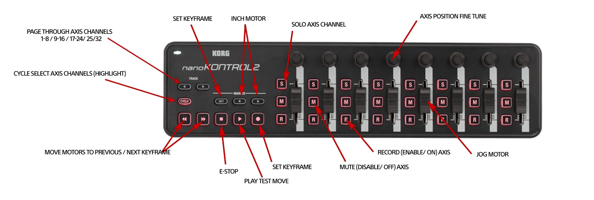

# nanoKONTROL Mapping Proposal — Status Tracker

This is a proposed set of Arc Motion Control mappings for the KORG nanoKONTROL2 — none of it is implemented. This tracks each proposed function against what's actually reachable from DragonMIDI, translated to the nanoKONTROL Studio (the hardware DragonMIDI targets — see `docs/high-level-design.md`).

**Status legend:**
- **Done** — already implemented in DragonMIDI today.
- **Possible** — a real mechanism exists (confirmed or strongly evidenced) but isn't built yet.
- **Unknown** — no candidate mechanism has been confirmed, and it hasn't been ruled out either; distinct from "Not possible," which means a mechanism was actively searched for and not found.
- **Not possible** — no mechanism DragonMIDI can reach has been found.
- **Not building** — a mechanism exists, but was deliberately rejected (see Implementation column for why).

## Confirmed: Dragonframe's Monogram WebSocket Channel

Full protocol details, wire format, complete test log, and the two ruled-out alternate protocols (DMC binary, DFRemote serial) now live in their own dedicated reference: **`docs/dragonframe-websocket-research.md`**. Summary for this doc's purposes: Dragonframe ships a bundled Monogram Creative Console integration and connects, at startup, to `ws://localhost:59177/com.dzed.dragonframe/DragonframeConnection` — a real, live-tested, bidirectional JSON channel, confirmed by `{"input": "Shoot"}` actually capturing a frame. It's a genuinely new, third output path alongside OSC and keystroke synthesis, with none of the jogpad-mode precondition risk that blocked several keyboard-based ideas below. **Not yet decided whether/how DragonMIDI should build on this** — it would mean adding a WebSocket client component, a real architectural addition warranting its own HLD-level discussion before any implementation.

## Proposed Mappings

| nanoKONTROL Studio control | Proposed mapping | Status | Implementation |
|---|---|---|---|
| Faders 1–8 | Jog Motor | **Done** | Already the default: Fader → `/dragonframe/axis/{name}/gotoPosition` (OSC axis direct target). `docs/llds/static-mapping.md` § OSC Axis (Direct) Target. The Monogram channel's `Jog All` / per-axis `jog-AXn` inputs are a possible future alternative, not needed since OSC already works here. |
| Knobs 1–8 | Axis Position Fine Tune | **Done** | Already the default: bank-derived Knob N → `stepPosition` nudge, scaled `0.1` per raw-value increment. `docs/llds/static-mapping.md` § Bank Derivation. |
| Play (▶) | Play Test Move | **Done** (partial) | Existing default `Play` → `/dragonframe/play` already plays back shot frames, including ones from a motion-control move. The Monogram channel also lists a `Play` input, presumably the same action, not DMC hardware's specific live "Run Move Test" — unconfirmed either way, not needed since OSC already covers the "review a move" intent. |
| Scene selector (up to 5 onboard scenes) | Page Through Axis Channels — click next scene to shift Fader 1↔9, 2↔10, etc., up to 40 addressable axes | **Possible** (unconfirmed) | Unrelated to the Monogram find — this is the nanoKONTROL Studio's own onboard Scene selector shifting DragonMIDI's own fader/knob bank offset, entirely self-contained. A KVR Audio forum thread confirms the hardware sends a distinguishable SysEx per scene change; exact byte pattern still needs empirical capture (same method as the original Scene-button reverse-engineering). Not yet attempted. |
| S (Solo) 1–8 | Solo Axis Channel | **Possible** (confirmed mechanism, semantics uncertain) | `select-AXn` is confirmed working (retargets `Jog All`, per the recoloring test), but whether "select" is the right semantic match for "Solo" is still a judgment call, not a protocol fact — it changes which axis generic actions target, which isn't quite the same idea as soloing a channel. The gamepad path (`docs/dragonframe-gamepad-research.md`) remains blocked regardless, so this is the only real option if pursued. |
| M (Mute) 1–8 | Mute (Disable/Off) Axis | **Not possible** | No `mute-AXn`/`disable-AXn`-shaped input appeared in the observed `replaceInputList` (only `jog-AXn`/`select-AXn` pairs), even with both scratch-project axes marked "Animator Controlled." Toggling the axis strip's own power/enable icon in Dragonframe's UI *is* observable over Monogram (`Jog All` recolors red/blue) but 14 candidate guesses (`enable-AX1`, `disable-AX1`, `power-AX1`, `toggle-AX1`, `Enable`/`Disable` with params, plus `Enable Axis`, `Disable Axis`, `Axis Enable`, `Axis Disable`, `Toggle Axis`, `Mute Axis`, `Record Axis`, `Solo Axis` from a later fuzz pass) were all **definitively rejected** — confirmed via Dragonframe's own debug log (`UNKNOWN Mono MSG`, see `docs/dragonframe-websocket-research.md` § The Log-File Oracle), not just wire-level silence. Highest-confidence negative result obtained so far, though not exhaustive. The DMC protocol has a matching `DMC_MOTOR_CONFIG_ENABLED` flag, but it's the wrong direction architecturally (Dragonframe → hardware, not controllable from an external tool). Gamepad/Monogram-hardware-only per the manual's Animator Controlled Axis entry otherwise, and gamepad is blocked. A full Dragonframe relaunch (not just a socket reconnect) was not tested and could still change the Monogram result. |
| R (Record) 1–8 | Record (Enable/On) Axis | **Not possible** | Same reasoning and same caveat as Mute. |
| Marker ◄/► | Inch Motor | **Possible** (needs confirmation) | `jog-AXn` (`reset: 0, step: 1`) looks like exactly this — a per-axis incremental jog, likely sent as `{"input": "jog-AX1", "operation": "+", "params": [1]}` per Monogram's own documented example shape. Untested directly, though the sibling `select-AXn`/`Step` inputs both worked exactly as their shape suggested, so confidence is reasonably high. |
| Cycle | Cycle Select Axis Channels (Highlight) | **Possible** (confirmed mechanism) | Cycling through `select-AX1`, `select-AX2`, ... is confirmed to work over the Monogram channel (see `docs/dragonframe-websocket-research.md`) — this fully replaces the rejected jogpad-mode approach with a safe alternative. |
| Set (Marker section) | Set Keyframe | **Unknown** | `Step` was confirmed to be a real, recognized Monogram command (via the log-file oracle, `docs/dragonframe-websocket-research.md` § The Log-File Oracle) but has no observed effect in the scratch project's current state — the earlier keyframe sighting was separately debunked as coincidental with an unrelated `Record` action, not caused by `Step`. A dedicated fuzz pass (`Set Keyframe`, `Keyframe`, `Add Keyframe`) was also definitively rejected. No candidate mechanism remains from wordlist guessing. Still blocked by the jogpad-mode precondition on the keyboard side; user decision (2026-07-19) was not to repeat that risk. Back to no known safe path. |
| Transport Record (●) | Set Keyframe | **Unknown** | Same as above. Also conflicts with the existing default: this button already sends `/dragonframe/shoot`. |
| Rewind (◄◄) / Fast Forward (►►) | Move Motors to Previous/Next Keyframe | **Unknown** | Same as above — no candidate mechanism left. Also conflicts with the existing default: these already send `stepBackward`/`stepForward` frame stepping. |
| Stop (■) | E-Stop | **Confirmed mechanism** | `E-Stop` is directly in the confirmed `inputs.json` list and is now confirmed recognized: sending it produced a `HARD STOP` line in Dragonframe's own debug log (`docs/dragonframe-websocket-research.md` § Live Test Results) — no jogpad-mode risk at all. Still conflicts with the existing default: this button already sends `/dragonframe/live`, so using it for E-Stop would need to replace that binding. Not yet built. |

## Open Items

1. **Decide whether to build a Monogram-protocol WebSocket client for DragonMIDI.** This is the highest-leverage finding here — it would unlock E-Stop and axis select/cycle (both confirmed mechanisms), and generally gives a safer path than keystroke synthesis for anything Dragonframe's own developers chose to expose this way. Needs its own HLD-level discussion (new component, new dependency, connection lifecycle, what happens if Monogram Service is *also* actually running and competing for port 59177) before any implementation.
2. **Scene selector paging** — still open, independent of the Monogram find. Needs the nanoKONTROL Studio's actual scene-change SysEx captured empirically.
3. **Set Keyframe / Move to Keyframe over the Monogram channel** — still unknown. Wordlist guessing (`Set Keyframe`, `Keyframe`, `Add Keyframe`) is now definitively exhausted (rejected via the log-file oracle, not just wire silence). If pursued further, would need a different approach entirely: inspecting Monogram Creator's own assignment UI (if ever installed) for keyframe-related presets not visible from the raw protocol, or inspecting the closed-source Dragonframe binary.
4. **Axis enable/disable (Mute/Record rows) and Set Keyframe remain the two open gaps** after this round of testing — now with *high-confidence* (not just lowered) evidence against a Monogram-side command existing under any of the 14 (enable/disable) + 3 (keyframe) candidate names tried, via the log-file oracle. Still not proof of absence. DMC and DFRemote (Dragonframe's other two protocols) were checked and ruled out for this purpose — see `docs/dragonframe-websocket-research.md`.
5. **A second, broader fuzzing round** (55 candidates: Dragonframe's full Hot Keys vocabulary plus riskier guesses `Cut Back`/`Reshoot Frames`, pre-authorized 2026-07-19 for this scratch project) has been run — all 55 rejected. Combined with round 1, 92 total candidates tried with zero new commands found; `docs/dragonframe-websocket-research.md` now treats `inputs.json`'s static list as fairly strongly (though not conclusively) evidenced to be complete.

## References

- `docs/dragonframe-websocket-research.md` — full Monogram WebSocket protocol reference: wire format, complete test log, and the DMC/DFRemote protocols checked and ruled out.
- `docs/dragonframe-hotkeys-research.md` — the Hot Keys table this analysis cross-references.
- `docs/dragonframe-gamepad-research.md` — the gamepad path blocked by macOS's DriverKit entitlement, still relevant to Mute/Record Axis Channel.
- `docs/high-level-design.md` § Non-Goals — "Multi-instance or bank-switching support" is currently scoped out; the Scene selector paging idea would revisit this if pursued.
